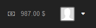
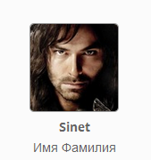

FaceViewer Widget for Yii 2
===========================

Виджет для отображения представления пользователя (например аватарки или фотографии). <br/>
FaceViewer может быть полезен, в случае, когда необходимо показывать представление пользователей по различным шаблонам и делать это частно. Например: аватарки в сообщениях пользователей, фотографии в отзывах, изображение профиля и др.

Пример отображения
------------------




Установка
---------

Предпочтительный способ установки этого виджета через [composer](http://getcomposer.org/download/).

Запустите в консоле

```
php composer.phar require --prefer-dist nepster-web/yii2-module-users: *
```

или добавьте

```
"nepster-web/yii2-faceviewer-widget": "*"
```

в файл `composer.json` в секцию require.


Конфигурации
--------------------------

**Все настройки:** <br/>

`template` - Шаблон представления. Может принимать как строку, так и callback функцию. <br/><br/>
{face} - Приобразуется в изображение. <br/> <br/>
Дополнительные атрибуты должны соответствовать атрибутам в `data`.
Например, если указать в шаблоне {name}, то поиск значения name будет выполнен либо в массиве `data`, либо в атрибутах модели пользователя, если указан его идентификатор (`userId`).


`templateUrl` - Заключает шаблон представление в URL адрес.


`templateUrlOptions` - Если шаблон представления заключен в URL адрес, то можно добавить любые атрибуты к ссылке.


`data` - Массив данных, которые подставляются в шаблон ({name} будет соответствовать $data['name']).


`userId` - Если мы работаем с пользователями, то вместо  `data` можно указать идентификатор пользователя, тогда faceviewer сам получит всю необходимую информаци.


`userModel` - неймспейс модели пользователя.


`userProfileRelated` - название реляции на профиль пользователя.


`userModelAttributes` - Атрибуты пользователя, которые будут получены при запросе. 


`faceField` - Название атрибута, который указывает на изображение (Например: avatar_url).


`facePath` - Полный путь к директории, например с аватарками (@statics/uploads/avatars).


`faceUrl` - URL адрес к папке, например с аватарками (/statics/uploads/avatars).


`faceUrlDefault` - URL адрес к папке, например с аватарками по умолчанию (/statics/templates/default/avatars).


`faceDefault` - Имя изображения по умолчанию, например аватарки (no-avatar.png).


`faceSexField` - Название атрибута, который указывает на пол (Например: sex).


`faceSexDefaultAvatar` - Изображения по умолчанию на основе пола пользователя (Например [1 => 'male.png', 2 => 'female.png']). <br/>
Где 1 - Мужской пол, 2 - Женский пол. В качестве идентификатора 1 или 2 выступает поле указанное в `faceSexField`.


`faceImgOptions` - Атрибуты изображения.


**Пример использования:**

```php      
<?= \nepster\faceviewer\Widget::widget([
    // шаблон отображения
    'template' => '<div class="face">{face}</div> <br/> <strong>{username}</strong> <p>{name} {surname}</p>',
    // Поле текущего изображения
    'faceField' => 'avatar_url',
    // Массив Данных пользователя
    'data' => $model->user,
    // Url адрес с загруженными аватарками 
    'faceUrl' => '/statics/uploads/avatars',
    // Директория с загруженными аватарками на сервере
    'facePath' => '@statics/uploads/avatars',
    // Url адрес с аватарками по умолчанию 
    'faceUrlDefault' => '/statics/templates/default/avatars',
    // Дефолтная аватарка
    'faceDefault' => 'male.png'
]);?>
```
`Результат:`



**Дополнительные примеры:**

```php 
<?php
// Вывод изображения включая пол
echo \nepster\faceviewer\Widget::widget([
    'template' => '{face} {name} {surname}',
    'data' => [
        'name' => 'Виктория',
        'surname' => 'Иванова',
        'sex' => 2, // К примеру 1 - М, 2 - Ж
    ],
    'faceUrl' => '/statics/uploads/avatars',
    'facePath' => '@statics/uploads/avatars',
    'faceUrlDefault' => '/statics/default',
    'faceDefault' => 'no-avatar.png',
    'faceField' => 'image_url',
    'faceSexField' => 'sex',
    // Дефолтные изображения исходя из поля sex
    'faceSexDefaultAvatar' => [
        1 => 'male.png',
        2 => 'female.png'
    ]
]);
?>
```

```php 
<?php
// Вывод изображения по ID пользователя
echo \nepster\faceviewer\Widget::widget([
    'template' => '{face} {name} {surname}',
    'userId' => 333,
    'faceUrl' => '/statics/uploads/avatars',
    'facePath' => '@statics/uploads/avatars',
    'faceUrlDefault' => '/statics/default',
    'faceDefault' => 'no-avatar.png',
    'faceField' => 'avatar_url',
    'userModel' => 'common\modules\users\models\User',
    'userModelAttributes' => ['name', 'surname', 'avatar_url']
]);
?>
```

```php 
<?php
// Использование callback-функции
echo \nepster\faceviewer\Widget::widget([
    'template' => function($data) {
        // Массив всех доступных данных
        var_dump($data);
    },
    'data' => [
        'name' => 'Иван',
        'surname' => 'Иванов',
    ],
    'faceUrl' => '/statics/uploads/avatars',
    'facePath' => '@statics/uploads/avatars',
    'faceUrlDefault' => '/statics/templates/default/avatars',
    'faceDefault' => 'no-avatar.png',
    'faceField' => 'image_url'
]);
?>
```

<br/>

Внимание, если в Вашей структуре есть разделение таблиц пользователей и профиля, то Вы можете использовать следующий синтаксис:
```
'userModelAttributes' => ['username', 'profile' => ['avatar_url', 'name', 'surname'] ],
```

FaceViewer возьмет свойство username из главной модели, а свойства avatar_url, name и surname попробует достать из реляции профиля.

<br/>

Рекомендации
--------------------------
<br/>
Если Вы используете данный виджет неоднократно, то нет необходимости при каждом вызове виджета передевать настройки на прямую. Можно реализовать передачу конфигурации по умолчанию.

Для этого можно использовать [DI](https://github.com/yiisoft/yii2/blob/master/docs/guide/concept-di-container.md):

```php  
// Настройки по умолчанию для виджета faceviewer
\Yii::$container->set('nepster\faceviewer\Widget', [
    // Url адрес с загруженными аватарками 
    'faceUrl' => '/statics/uploads/avatars',
    // Директория с загруженными аватарками на сервере
    'facePath' =>  '@statics/uploads/avatars',
    // Url адрес с аватарками по умолчанию 
    'faceUrlDefault' => '/statics/templates/default/avatars',
    // Дефолтная аватарка
    'faceDefault' => 'no-avatar.png'
]);
```

Предложенный код можно разместить в `init` необходимого модуля или в `init` общего контроллера.